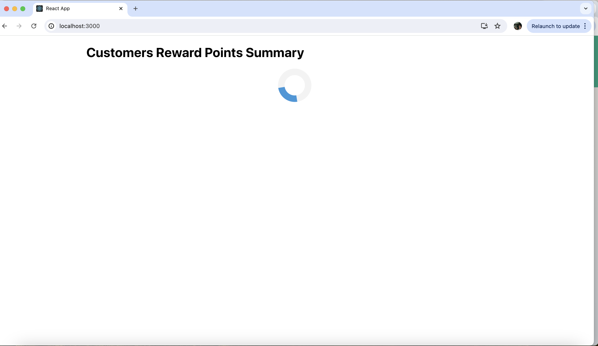
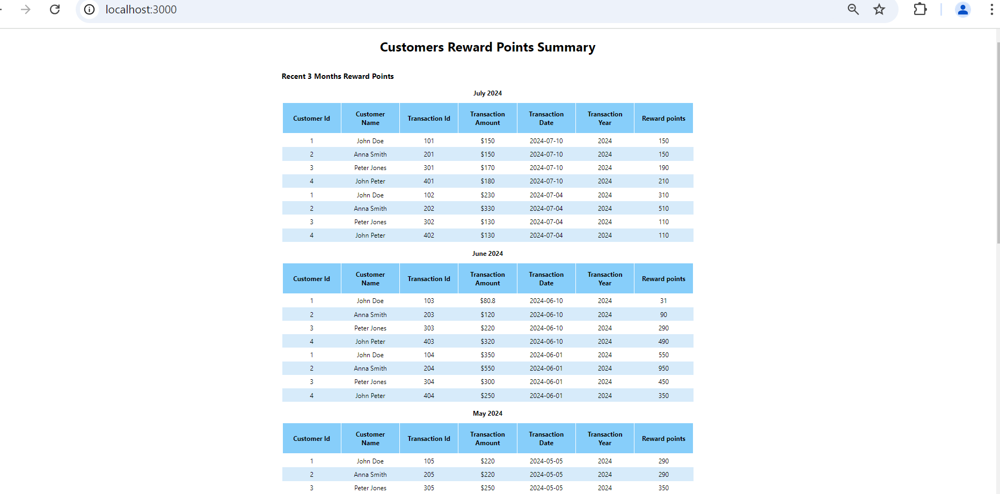

# Customer Reward points summary

This project was bootstrapped with [Create React App](https://github.com/facebook/create-react-app).

## Problem statement

A retailer offers a rewards program to its customers, awarding points based on each recorded purchase.  

A customer receives 2 points for every dollar spent over $100 in each transaction, plus 1 point for every dollar spent between $50 and $100 in each transaction. 

(e.g. a $120 purchase = 2x$20 + 1x$50 = 90 points). 
  
Given a record of every transaction during a three month period, calculate the reward points earned for each customer per month and total. 

## Running the project

### Clone the project from github repository

`https://github.com/somarajAtcha/rewardPointsApp.git`

### Install the dependencies

`npm install`

### Run the app in development mode.

`npm run start`

### Launch the test runner in interactive watch mode.

`npm test`

### Build the app for production to the `build` folder.

`npm run build`

## Screen shots of application

### Application loading state

### Application running state

### Application error

### Test cases

## Sample data

To modify the data, make changes to the file in public/data/rewardPoints.json

## Approach

- Step 1 - Fetch the data using fetch from local json.
- Step 2 - Calculate the points for given transactions for each transaction, monthly and total rewards.
- Step 3 - Display the data in tabular format.

## Credits
List of contributors:
- [Somaraj Atcha - Developer](somarajvarma309@gmail.com)